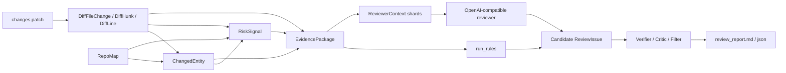
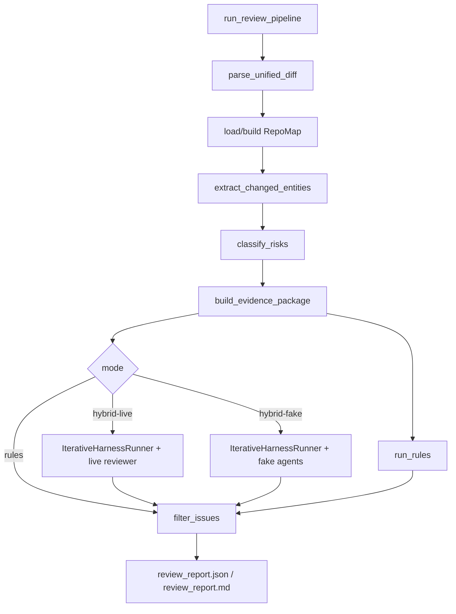
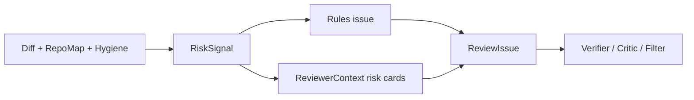
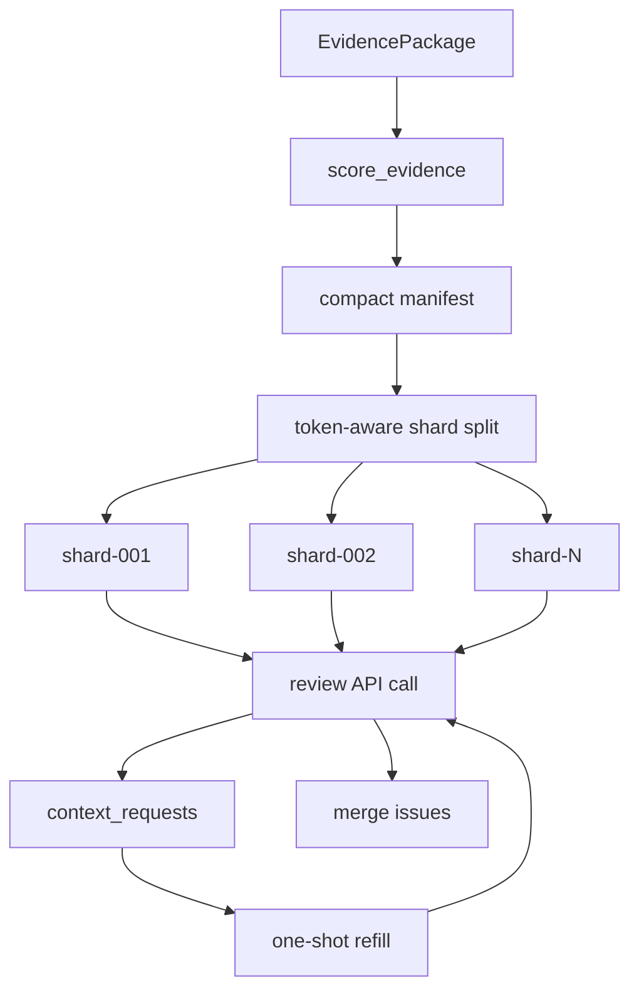
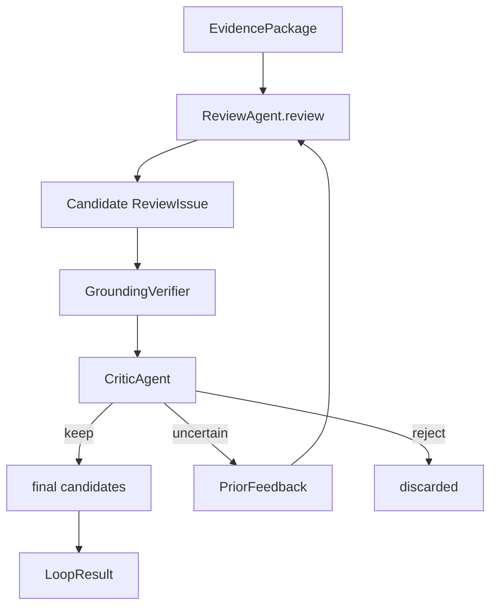

# Code Review Agent 架构总览

本文按当前代码状态重写，目标是让人快速理解：项目怎么从 diff 变成 evidence，再怎么把 evidence 交给规则和 live reviewer，最后如何生成可审计的 review 报告。

## 当前定位

`code-review-agent` 是一个本地 Code Review Harness。它不直接修改被审查仓库，而是把一次 patch 解析成结构化证据，经过规则、LLM reviewer、verifier、critic、filter，输出 Markdown 和 JSON 报告。

核心原则只有三个：

- **先构造证据**：所有 issue 都必须引用 `evidence_ids`。
- **再让模型判断**：模型看到的是预算内的 `ReviewerContext`，不是完整仓库。
- **最后做收口**：verifier/filter 会丢弃无证据、越界、纯风格或低信号建议。

## 数据模型速查

主流程优先理解 `models.py` 里的 25 个共享 dataclass。整个 `src/code_review_agent` 当前共有 42 个 dataclass，其余多是模块内部审计或结果容器。

| 模型/概念 | 含义 | 主要内容 | 主要去向 |
|---|---|---|---|
| `RepoMap` | 仓库地图 | 文件列表、Python AST 摘要、imports、related tests、style baseline | review 风险分析、changed entity 映射 |
| `DiffFileChange` | 单文件 diff | old/new path、change_type、hunks | entity、risk、evidence |
| `DiffHunk` | unified diff 的 hunk/window | old/new 范围、section、`DiffLine` 列表 | `diff_hunk` evidence，live 主输入 |
| `DiffLine` | hunk 内单行 | added/removed/context、新旧行号、内容 | 精确定位和兼容旧 evidence |
| `ChangedEntity` | 被 diff 命中的符号 | 文件、函数/类/模块名、行号范围、hunk ids | risk、evidence、report |
| `RiskSignal` | 规则层风险信号 | tag、confidence、reason、evidence_ids | rules、live context、report |
| `ReviewEvidence` | 可追踪证据项 | id、kind、source、message | `EvidencePackage.evidence_index` |
| `EvidencePackage` | review 的完整内部证据包 | changed files、entities、risks、evidence index、metadata | rules、agent、verifier、filter |
| `ReviewerContext` | 发给模型的证据切片 | shard 信息、摘要卡片、展开 evidence、available context、预算审计 | live API |
| `ContextRequest` | 模型请求补充上下文 | request_type、path、evidence_ids、risk_tag、reason | refill context |
| `ReviewIssue` | 候选/最终问题 | file、line、severity、category、message、suggestion、confidence、evidence_ids | verifier、critic、filter、output |
| `AgentRun` | agent 调用审计 | model、tokens、latency、retry、status、shard_id、trace | JSON report |
| `CritiqueResult` | critic 判断 | keep、uncertain、reject、agent_runs | loop runner |
| `PriorFeedback` | 上一轮反馈 | iteration、uncertain items | 下一轮 reviewer |

几个容易混的点：

- `ReviewAgent.review()` 是协议方法，不是数据类；输入 `EvidencePackage`，输出候选 `ReviewIssue`。
- `Candidate ReviewIssue` 不是新模型，只是还没通过 verifier/critic/filter 的 `ReviewIssue`。
- `RiskSignal` 不是最终评论，它只是“这里值得看”的 deterministic 信号。
- `ReviewerContext` 是 LLM-facing 输入；`EvidencePackage` 是完整内部事实源。

## 目录与模块

| 模块 | 入口文件 | 职责 |
|---|---|---|
| CLI | `src/code_review_agent/cli.py` | 注册 `map`、`hygiene`、`review`、`eval` 命令 |
| Models | `src/code_review_agent/models.py` | 共享数据契约 |
| Context | `src/code_review_agent/context/repo_map.py` | 建立 repo map、AST 符号、imports、related tests |
| Hygiene | `src/code_review_agent/hygiene/*` | 分类主线代码、测试、实验脚本、过程文档、生成产物 |
| Review | `src/code_review_agent/review/*` | diff 解析、风险分析、evidence、agent loop、过滤 |
| Output | `src/code_review_agent/output/*` | JSON schema 和 Markdown 渲染 |
| Eval | `src/code_review_agent/eval/*` | planted-bug benchmark 和回归指标 |

## Review Pipeline

`review` 命令最终进入 `run_review_pipeline()`。CLI 只收集参数，业务逻辑在 review 模块。

三种模式：

- `rules`：只跑确定性规则，最快、可复现。
- `hybrid-fake`：用 fake reviewer/critic 跑完整 loop，不调用 API，适合测试 harness。
- `hybrid-live`：调用 OpenAI-compatible API，用真实模型审查 shard/refill。

## Evidence 机制

`build_evidence_package()` 会把 diff、entity、test discovery、hygiene、risk 全部合并进 `evidence_index`。

当前重要 evidence kind：

| kind | 示例 | 用途 |
|---|---|---|
| `diff_hunk` | `diff_hunk:src/foo.py:120` | hunk/window 证据，live review 的主要代码上下文 |
| `diff` | `diff:src/foo.py:123` | added/removed 单行，主要用于精确定位和兼容旧规则 |
| `entity` | `entity:src/foo.py:Service.create` | 被改动的符号摘要 |
| `risk` | `risk:test_gap:src/foo.py` | 风险信号摘要 |
| `test_discovery` | `test_discovery:tests/test_foo.py` | related test 发现结果 |
| `hygiene` | `hygiene:scripts/demo.py` | hygiene 分类证据 |

现在的设计重点是：**给模型优先展开 `diff_hunk`，不再把单行 diff 当作主要推理单位**。单行 evidence 仍保留，因为 report、定位、旧规则和部分风险逻辑还需要它。

## Risk 到 Issue

风险层只负责提出信号，不直接等同于 finding。

例如 `test_gap`：如果主线文件改了、repo map 找到了相关测试，但 patch 没改这些测试，就产生 `RiskSignal(tag="test_gap")`。随后 rules 可以把它变成 `ReviewIssue`，live reviewer 也可以结合 hunk 判断它是否是真问题。

## Live Shard 与 Context Budget

大 diff 不会一次性发给模型。`context_budget.py` 会先构造预算内的 `ReviewerContext`：

当前策略：

- `DEFAULT_CONTEXT_BUDGET_TOKENS = 24000` 是用户层默认预算。
- live 单次调用会被压到 `DEFAULT_MAX_SHARD_INPUT_TOKENS = 9000`。
- shard 策略是 `file_risk_shards_v1`，按文件和估算 token 贪心切分。
- context profile 是 `risk_compact_manifest_v1`。
- 默认展开 `diff_hunk`、`test_discovery`、`hygiene`；`risk` 和 `entity` 更多通过摘要卡片和 manifest 表达。
- refill 是 `one_shot_refill_v1`，每个请求最多补有限数量 evidence，避免补上下文时再次爆 token。

`ReviewerContext` 里最关键的字段：

| 字段 | 内容 |
|---|---|
| `changed_files` | 当前 shard 的文件级变更摘要，不包含完整 diff |
| `changed_entities` | 受影响符号卡片，有数量上限 |
| `risk_signals` | 风险卡片，有 primary evidence 和 reason |
| `evidence_index` | 本次真正展开给模型看的 evidence，主要是 `diff_hunk` |
| `available_context` | 模型可请求的 evidence 清单和路径/风险索引 |
| `context_budget` | token 估算、选中/省略 evidence、warnings、shard 审计 |

## Review Loop

hybrid 模式会跑 bounded loop：reviewer 提候选问题，verifier/critic 做证据和质量收口，不确定项作为下一轮反馈。

收敛条件在 `loop.py`：

- critic 没有 uncertain，收敛。
- 连续两轮 issue 集合不再变化，收敛。
- 达到 `--max-iter` 后停止。

loop 会写 `loop_checkpoint.json`。live 模式还会写 `live_context_checkpoint.json`，用于相同 diff/package 下的 resume。

## Live 失败处理

当前 live 不是“一个 shard 失败就全局失败”的老行为。现在：

- 单个 primary shard transient error 会被记录并跳过，其他 shard 继续。
- refill transient error 不会中断主流程。
- 只有所有 primary shard 都失败且没有 issue 时，才整体 fallback。
- 发生 fallback 时，pipeline 会尽量保留已有 agent runs，并尝试从 checkpoint 恢复已经完成的 loop 结果。
- 非 resume 运行开始前会清理同一 `--out` 目录里的旧 checkpoint 文件，避免旧上下文污染新报告。

## 质量控制

候选 issue 到最终 report 之间有几层控制：

| 层 | 作用 |
|---|---|
| verifier | 检查 evidence id 是否存在、位置是否在变更范围、是否可追踪 |
| critic | fake precision-biased critic，用于把弱问题降级为 uncertain/reject |
| filter | 合并重复、丢弃 out-of-diff、style-only、低信号建议 |
| issue_quality | 共享低信号启发式，保留具体 correctness/security failure |

低信号过滤的目标不是追求“没意见”，而是避免模型输出评论型噪音，例如“加注释”“更清晰”“可能有问题但没有失败场景”。

## 输出结构

每次 review 写两个文件：

- `review_report.json`：机器可读，包含完整 evidence、risk、agent run、context budget、discarded。
- `review_report.md`：人类可读，适合快速看 findings 和人工复核项。

JSON 里常看的字段：

| 字段 | 含义 |
|---|---|
| `summary.mode` | `rules` / `hybrid-fake` / `hybrid-live` / fallback 模式 |
| `summary.fallback_used` | live 是否失败并 fallback |
| `summary.loop_iterations_completed` | loop 实际完成轮数 |
| `summary.total_token_count_in/out` | API 返回的 token 用量 |
| `context_budget.shards` | 每个 primary/refill shard 的 token、选中 evidence、截断状态 |
| `agent_runs` | 每次 reviewer/critic 调用的状态、retry、latency、trace |
| `discarded` | 被 filter 或 loop 丢弃的问题 |

最近一次 live 验证 run：`outputs/runs/20260509-185258-live-codex-final`。

- `mode = hybrid-live`
- `fallback_used = false`
- 17 个 changed files，97 个 changed entities，82 个 risk signals
- 6 个 primary shard + 6 个 refill shard
- 13 次 agent run，全部 `ok`
- selected evidence 79，omitted evidence 984
- warnings 为空
- findings 5，needs human review 5，discarded 2

这个结果说明当前 live harness 已经能完整跑通大 diff，并且不会因为单个上下文预算问题直接失败。但从 findings 质量看，它仍更适合作为“辅助 reviewer”，还不适合直接当阻断式生产 gate。

## 推荐阅读顺序

1. `src/code_review_agent/models.py`：先看数据契约。
2. `src/code_review_agent/review/pipeline.py`：看 review 总控。
3. `src/code_review_agent/review/evidence.py`：看 evidence 如何生成。
4. `src/code_review_agent/review/context_budget.py`：看 shard、manifest、refill。
5. `src/code_review_agent/review/agents.py`：看 fake/live reviewer、重试、checkpoint。
6. `src/code_review_agent/review/filter.py` 和 `review/issue_quality.py`：看最终质量控制。
7. `src/code_review_agent/review/risk.py` 和 `rules.py`：看确定性风险和规则 finding。
