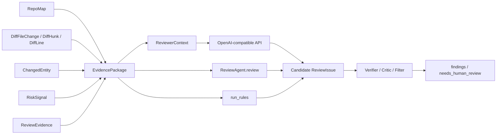
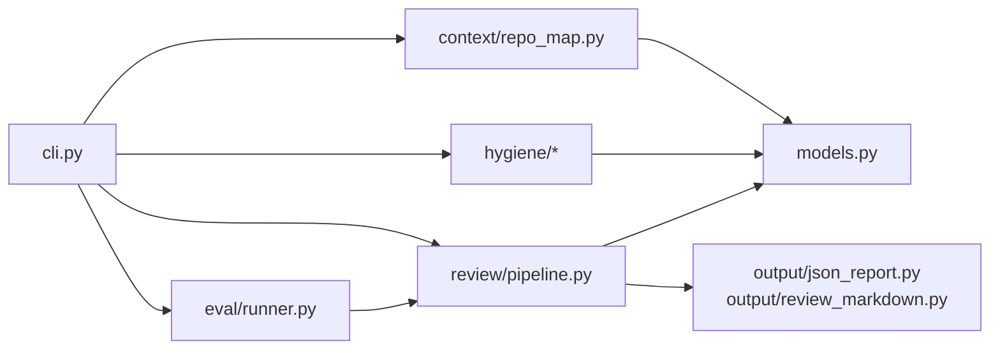
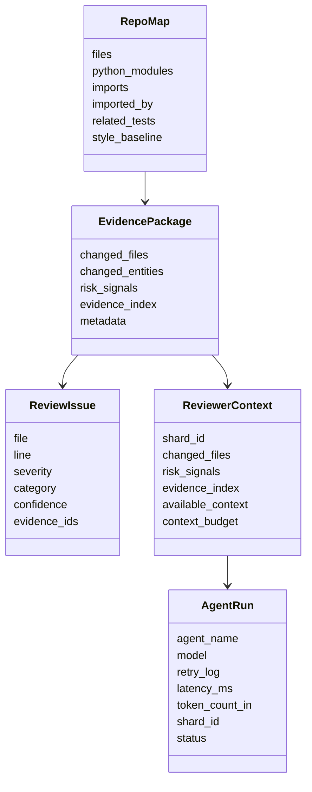
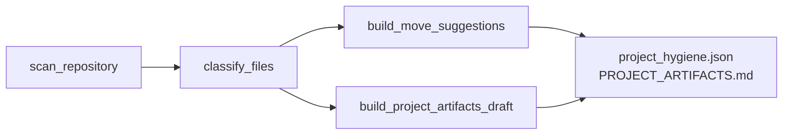
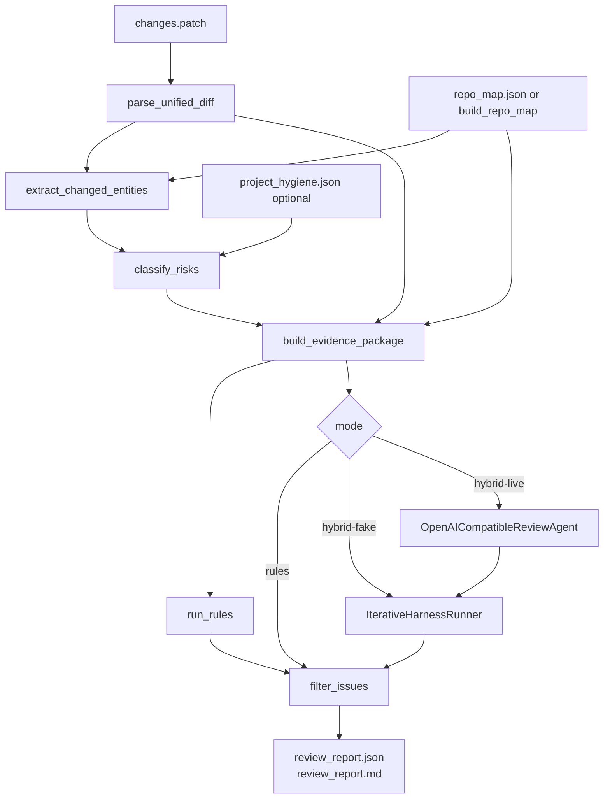
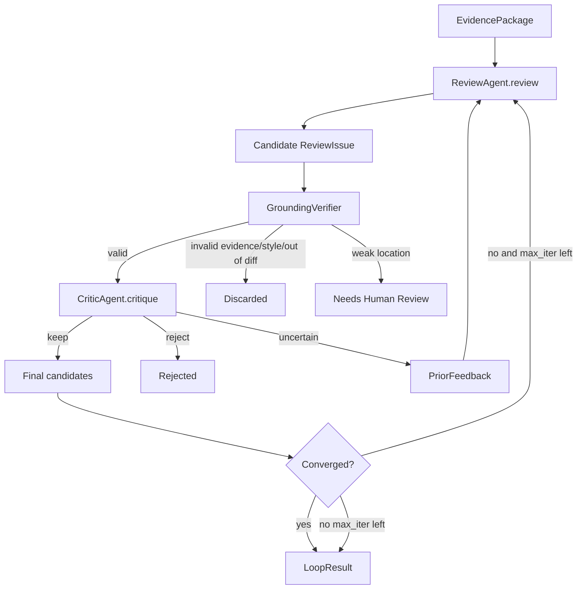
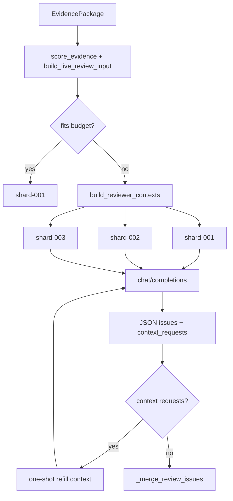
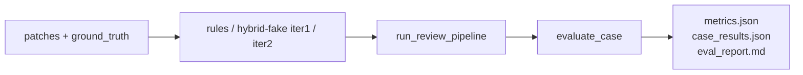

# Code Review Agent 架构与流程

本文面向想快速读懂当前代码的人：先看整体数据流，再看各模块职责，最后看 review loop 和 live shard。项目核心思想是 **先用确定性代码构造证据，再让规则或受约束 agent 基于证据输出 review**。

## 数据模型速查

先把几个容易混的名字拆开：

- `EvidencePackage` 是 review 阶段的完整内部证据包，给规则、agent、verifier、filter 使用。
- `ReviewerContext` 是从 `EvidencePackage` 里切出来的 LLM 输入片段，通常对应一个 live shard。
- `ReviewIssue` 是问题本身的数据结构；candidate issue、final finding、needs-human-review item 本质上都是 `ReviewIssue`，只是处在不同流程阶段。
- `ReviewAgent.review()` 不是数据类，而是一个协议方法：输入 `EvidencePackage`，输出 `list[ReviewIssue]`。
- `Candidate ReviewIssue` 不是单独模型，只表示“reviewer 刚提出、还没经过 verifier/critic/filter 的 `ReviewIssue`”。

当前项目里，`src/code_review_agent/models.py` 定义了 **25 个共享 dataclass**。如果把各模块内部的辅助 dataclass 也算上，当前共有 **42 个 dataclass**。阅读主流程时优先理解共享模型即可。



### 最核心的 Review 模型

| 模型/概念 | 是什么 | 里面有什么 | 由谁生成 | 发给谁 |
|---|---|---|---|---|
| `EvidencePackage` | 一次 review 的完整结构化上下文 | `changed_files`、`changed_entities`、`risk_signals`、`evidence_index`、metadata | `review/evidence.py::build_evidence_package()` | `rules.py`、`ReviewAgent.review()`、`verifier.py`、`filter.py`、report builder |
| `ReviewIssue` | 一条 review 问题 | file、line、severity、category、message、suggestion、confidence、`evidence_ids` | rules、fake/live reviewer、fallback 逻辑 | verifier、critic、filter、output report |
| `ReviewerContext` | 发给 live 模型的压缩证据切片 | shard id、变更文件摘要、风险卡片、primary evidence、`available_context`、context budget | `review/context_budget.py::build_live_review_input()` | `OpenAICompatibleReviewAgent._review_context()`，随后序列化进 API body |
| `ContextRequest` | 模型请求补充上下文 | request_type、path、evidence_ids、risk_tag、symbol、reason | live 模型 JSON 返回后解析 | `build_context_refill()`，用于生成 refill `ReviewerContext` |
| `PriorFeedback` | 上一轮 critic 给下一轮 reviewer 的反馈 | iteration、`UncertainFeedbackItem` 列表 | `loop.py` | 下一轮 `ReviewAgent.review(package, prior_feedback=...)` |
| `UncertainFeedbackItem` | critic 认为不确定的问题摘要 | issue_id、category、critic_reason、original_confidence、evidence_ids | critic | `PriorFeedback`，也进入 loop report |
| `CritiqueResult` | critic 对一轮候选问题的判断 | keep、uncertain、reject、agent_runs | `CriticAgent.critique()` | loop runner |
| `AgentRun` | agent 调用审计记录 | agent/model/prompt hash、输入证据、输出 issue、retry、token、latency、shard、status | fake/live reviewer、critic 或 loop runner | `review_report.json` 的 `agent_runs` / `tracing` |

### `models.py` 里的 25 个共享 dataclass

| 分组 | 模型 | 内容 | 主要流向 |
|---|---|---|---|
| Hygiene | `HygieneEvidence` | 单文件内容 sample、imports、被测试引用、配置声明、分类信号 | hygiene LLM 分类输入 |
| Hygiene | `SemanticClassification` | LLM 语义分类结果：artifact_type、confidence、action、reason | hygiene report / uncertain queue |
| Hygiene | `FileClassification` | 规则分类结果：category、mainline_relevance、confidence、signals | hygiene report；review risk 可读取 |
| Hygiene | `MoveSuggestion` | 建议移动的源路径、目标路径、原因、置信度 | hygiene Markdown/JSON |
| Context | `SymbolSummary` | 一个 class/function/method 的路径、名称、行号范围 | `PythonModuleSummary`、changed entity 映射 |
| Context | `PythonModuleSummary` | 单个 Python 文件的 AST 摘要：imports、classes、functions、methods | `RepoMap` |
| Context | `StyleBaseline` | docstring 覆盖率、import 风格、测试命名模式等 | design constraint risk |
| Context | `RepoMap` | 仓库地图：文件列表、模块摘要、imports、related_tests、style baseline | review pipeline |
| Diff | `DiffLine` | hunk 中一行 added/removed/context 及新旧行号 | `DiffHunk` |
| Diff | `DiffHunk` | unified diff hunk 的范围、section、行列表 | `DiffFileChange` |
| Diff | `DiffFileChange` | 一个文件级 diff：old/new path、change_type、hunks | changed entity、risk、evidence |
| Review | `ChangedEntity` | 被 diff 命中的函数/方法/类/模块 | risk、evidence、report |
| Review | `RiskSignal` | 确定性风险标签、原因、置信度、证据 ID | rules、agent context、report |
| Review | `ReviewEvidence` | 一条可追踪证据：id、kind、source、message | `EvidencePackage.evidence_index` |
| Review | `ReviewIssue` | 一条问题/候选问题/最终 finding | verifier、critic、filter、report |
| Review | `EvidencePackage` | review 的完整证据包 | rules、agent、verifier、filter |
| Live | `ContextRequest` | 模型请求补充上下文 | context refill |
| Live | `ReviewerContext` | LLM-facing shard/refill 输入 | live API |
| Live | `ReviewShard` | shard 审计元数据：路径、证据、token、状态 | 设计/审计模型，当前主流程主要用 `context_budget.shards` 字典 |
| Live | `ShardReviewResult` | 单 shard 输出：issues、context_requests、agent_runs、status | 设计/聚合模型，当前主流程主要直接合并 issues |
| Loop | `UncertainFeedbackItem` | critic 的不确定反馈项 | `PriorFeedback` |
| Loop | `PriorFeedback` | 传给下一轮 reviewer 的反馈 | `ReviewAgent.review()` |
| Agent | `AgentRun` | reviewer/critic/live 调用的审计与 tracing | report |
| Loop | `CritiqueResult` | critic 输出 keep/uncertain/reject | loop runner |
| Hygiene report | `ReviewReport` | hygiene 命令早期复用的报告容器 | hygiene JSON/Markdown |

### 模块内部辅助 dataclass

这些类不属于 `models.py` 的共享契约，主要用于某个模块内部组织结果：

| 模块 | dataclass | 用途 |
|---|---|---|
| `hygiene/scanner.py` | `ScannedFile`、`_GitignoreRule` | 扫描文件元数据、解析 `.gitignore` |
| `review/rules.py` | `RulesReviewResult` | rules 输出 findings / needs_human_review |
| `review/agents.py` | `FakeAgentResult`、`FakeLLMReviewAgent`、`FakeLLMCriticAgent`、`OpenAICompatibleReviewAgent` | fake/live agent 实现和状态 |
| `review/loop.py` | `IterationRecord`、`LoopResult`、`IterativeHarnessRunner` | loop 每轮记录、最终结果、runner 配置 |
| `review/verifier.py` | `GroundingDiscardedIssue`、`VerifierResult` | verifier 分流结果 |
| `review/filter.py` | `DiscardedIssue`、`FilterResult` | 最终 filter 分流结果 |
| `review/context_budget.py` | `SelectedEvidenceAudit`、`LiveReviewInput` | live 输入选择审计、单次 LLM payload |
| `eval/cases.py` | `EvalCase` | eval case 元数据 |

## 一句话架构

`code-review-agent` 是一个本地 Code Review Harness：

- `map` 建立仓库地图：文件、import、符号、相关测试、风格基线。
- `hygiene` 识别过程资产：实验脚本、临时文档、生成产物等。
- `review` 解析 diff，生成风险信号和 evidence package，再输出 findings。
- `eval` 用内置 planted-bug cases 验证 precision、recall、no-finding 等指标。

所有正式 review issue 都必须引用 `evidence_ids`，否则会被 verifier/filter 丢弃或降级。

## 模块总览



| 模块 | 入口 | 职责 |
|---|---|---|
| CLI | `src/code_review_agent/cli.py` | 注册 `map` / `hygiene` / `review` / `eval` 命令 |
| Models | `src/code_review_agent/models.py` | dataclass 数据契约，模块间只传结构化模型 |
| Context | `context/repo_map.py` | AST 扫描 Python 模块，建立 imports、symbols、related tests、style baseline |
| Hygiene | `hygiene/*` | 扫描仓库并分类 main/test/dev/experiment/doc/artifact |
| Review | `review/*` | diff 解析、实体映射、风险分类、证据包、规则/agent review、过滤 |
| Output | `output/*` | 稳定 JSON schema 和 Markdown 报告 |
| Eval | `eval/*` | 批量跑内置 benchmark，计算可复现指标 |

## CLI 调度

所有命令都从 `build_parser()` 注册，最终调用对应 handler。`review` 命令只是收集参数，然后把工作交给 `run_review_pipeline()`：

```python
# src/code_review_agent/cli.py
report = run_review_pipeline(
    args.repo,
    args.diff,
    args.out,
    repo_map_path=args.repo_map,
    hygiene_path=args.hygiene,
    mode=args.mode,
    export_prompts=args.export_prompts,
    max_iter=args.max_iter,
    resume=args.resume,
    context_budget=args.context_budget,
    max_files_per_agent_call=args.max_files_per_agent_call,
    max_evidence_per_file=args.max_evidence_per_file,
)
```

这意味着 CLI 不承担业务逻辑，核心行为都集中在模块实现里。

## 核心数据模型

`models.py` 是整个项目的边界层。几个最重要的对象：



设计原则很直接：**任何 issue 都不是一段自由文本，而是带位置、类别、置信度和证据 ID 的结构化对象**。

## Map 原理

`map` 命令调用 `build_repo_map()`：

```python
# src/code_review_agent/context/repo_map.py
scanned_files = scan_repository(root)
python_paths = [path for path in files if path.endswith(".py")]

for relative_path in python_paths:
    summary = _summarize_python_module(root, relative_path)
    modules.append(summary)
    import_map[relative_path] = summary.imports

related_tests = discover_related_tests(root, python_paths, modules)
```

它做三件事：

1. 复用 hygiene scanner 扫描仓库文本文件。
2. 用 Python AST 提取 classes、functions、methods、imports。
3. 用命名约定和 import/symbol 引用推断 related tests。

这些结果在 review 阶段用于判断“改了哪个函数”“相关测试是否同步修改”“是否违反项目风格基线”。

## Hygiene 原理

`hygiene` 先扫描文件，再做规则分类：



scanner 只读仓库，跳过 `.git`、虚拟环境、构建产物、输出目录、大文件和二进制文件。classifier 主要根据路径、文件名、内容 sample、是否被本地 import 判断类别。

典型分类：

- `main_code`: `src/`、`lib/`、`app/` 下的 Python 主线代码，或被本地模块 import 的文件。
- `test_code`: `tests/` 或 `test_*.py`。
- `experiment` / `artifact` / `dev_script`: 用于识别不该混入主线 review 的过程资产。

## Review 主流程

`review` 是项目的核心命令，入口是 `run_review_pipeline()`。



关键步骤：

1. `diff_parser.py` 把 unified diff 解析成 `DiffFileChange` / `DiffHunk` / `DiffLine`。
2. `changed_entity.py` 把 hunk 行号映射到 AST 符号，找不到则退化到 module。
3. `risk.py` 产生确定性风险信号，例如 `test_gap`、`api_change`、`security_sensitive`。
4. `evidence.py` 生成统一 `EvidencePackage`，包括 diff/entity/risk/test_discovery/hygiene evidence。
5. `rules.py` 把高置信 deterministic risk 转成 baseline finding。
6. hybrid 模式额外跑 agent loop。
7. `filter.py` 做最终误报控制，保证 issue 有有效证据、位置合理、不是纯风格偏好。

## 风险信号到 Finding

风险信号不是最终 issue，只是“这个 patch 有值得看的风险”。例如 `test_gap` 的检测逻辑：

```python
# src/code_review_agent/review/risk.py
related_tests = repo_map.related_tests.get(path, [])
if related_tests and not any(test_path in changed_test_paths for test_path in related_tests):
    signals.append(
        RiskSignal(
            tag=TEST_GAP,
            confidence=0.8,
            reason=f"{path} changed while related tests exist...",
            evidence_ids=[...],
        )
    )
```

随后 `rules.py` 才把它转成用户能看到的 review issue：

```python
# src/code_review_agent/review/rules.py
if signal.tag == TEST_GAP:
    result.findings.append(_test_gap_issue(signal, package))
```

这样做的好处是：risk 层可扩展，rules/agent/filter 可以分别决定哪些风险要自动报告、哪些只进入人工复核。

## Evidence 机制

EvidencePackage 是 review 的中心对象：

```python
# src/code_review_agent/review/evidence.py
_add_many(evidence_index, _diff_evidence(changes))
_add_many(evidence_index, _entity_evidence(changed_entities))
_add_many(evidence_index, _test_discovery_evidence(repo_map))
_add_many(evidence_index, _hygiene_evidence(hygiene_classifications or []))
_add_many(evidence_index, _risk_evidence(risk_signals))
```

常见 evidence id：

| kind | 示例 | 含义 |
|---|---|---|
| `diff` | `diff:src/shop/service.py:18` | 某一行新增/删除 diff |
| `entity` | `entity:src/shop/service.py:create_order` | 被 diff 影响的函数/类/模块 |
| `risk` | `risk:test_gap:src/shop/service.py` | 某个风险信号摘要 |
| `test_discovery` | `test_discovery:tests/test_service.py` | 相关测试发现结果 |
| `hygiene` | `hygiene:scripts/foo.py` | hygiene 分类结果 |

filter/verifier 的基本规则是：没有 evidence 的 issue 不进入正式 findings。

## Review Loop

hybrid 模式会启用 bounded loop：reviewer 先提出候选 issue，verifier 检查证据，critic 判断保留/不确定/拒绝，再把不确定反馈给下一轮 reviewer。



收敛条件在 `loop.py` 里：

```python
def _converged(records, critique):
    if not critique.uncertain:
        return True
    if len(records) >= 2 and records[-1].issue_set == records[-2].issue_set:
        return True
    return False
```

也就是说：

- critic 没有不确定项，直接收敛。
- 连续两轮 issue 集合不再变化，也认为收敛。
- 否则继续，直到 `max_iter`。

loop 每轮还会写 `loop_checkpoint.json`，`--resume` 时会检查 schema、mode、package hash、diff hash，匹配才恢复。

## Live 模式与 Shard

`hybrid-live` 使用 `OpenAICompatibleReviewAgent`，从环境变量读取配置：

- `SILICONFLOW_API_KEY` 或 `OPENAI_COMPATIBLE_API_KEY`
- `SILICONFLOW_BASE_URL` 或 `OPENAI_COMPATIBLE_BASE_URL`
- `SILICONFLOW_MODEL` 或 `OPENAI_COMPATIBLE_MODEL`

live 调用不会直接发送完整 EvidencePackage，而是先构造预算内的 `ReviewerContext`：



当前 shard 逻辑在 `context_budget.py`：

```python
chunks = [
    paths[index : index + max(1, max_files)]
    for index in range(0, len(paths), max(1, max_files))
]
```

也就是按 changed file 数量切片。每个 shard 再构造一个 `risk_compact_manifest_v1` 压缩视图：默认只展开每个风险最关键的 diff/test/hygiene primary evidence；`risk` 和 `entity` 这类已经在风险卡片、changed entity 中表达过的信息不再重复展开，而是放入 `available_context` manifest，供模型通过 context request 请求。

当前实现的一个限制是：shard 调用是串行的；某个 shard 抛出 `_AgentTransientError` 或 `_AgentFatalError` 后，pipeline 会整体进入 `hybrid-live/fallback-rules`。这也是大 diff 下需要继续改进的地方。

## Output 与审计

最终报告由 `_build_report_dict()` 统一组装，再交给 output 模块写出：

```python
report = {
    "summary": {...},
    "findings": [...],
    "needs_human_review": [...],
    "discarded": [...],
    "changed_files": [...],
    "changed_entities": [...],
    "risk_signals": [...],
    "evidence_index": {...},
    "agent_runs": [...],
    "context_budget": {...},
    "loop": {...},
    "tracing": {...},
}
```

`review_report.json` 是机器可读审计结果，`review_report.md` 是人类阅读报告。报告里比较重要的字段：

- `summary.mode`: `rules` / `hybrid-fake` / `hybrid-live` / `hybrid-live/fallback-rules`
- `summary.fallback_used`: live 是否失败并 fallback
- `summary.loop_iterations_completed`: loop 实际跑了几轮
- `summary.total_token_count_in/out`: live API 是否真实返回 token usage
- `context_budget.shards`: 每个 shard 的 evidence 数、估算 token、是否截断
- `agent_runs`: 每次 reviewer/critic 调用的 tracing、retry、status

## Eval 原理

`eval` 会对 `examples/eval_cases` 里的 patch 逐个调用 review pipeline，再用 deterministic oracle 计算指标：



它不用 LLM judge，而是比较文件、类别、行范围重叠，因此结果可复现，适合回归测试和 demo。

## 当前设计取舍

优点：

- evidence-first，减少模型幻觉和不可追踪评论。
- 规则层、agent 层、filter 层分离，方便定位误报来源。
- JSON report 保留完整审计链路，适合做质量门禁。
- fake agent 和 eval 让核心 harness 不依赖外部 API 也能回归。

限制：

- RepoMap 主要支持 Python，其他语言还没有 AST 级支持。
- live shard 当前按文件数切，不保证 token 均衡。
- live shard 串行执行，单 shard 超时会导致整轮 fallback。
- critic 目前是 fake/deterministic，真实 critic 编排还未完全产品化。

## 推荐阅读顺序

1. `src/code_review_agent/cli.py`: 看命令怎么进入系统。
2. `src/code_review_agent/models.py`: 看所有模块共享的数据契约。
3. `src/code_review_agent/review/pipeline.py`: 看 review 总控流程。
4. `src/code_review_agent/review/risk.py`: 看风险信号从哪里来。
5. `src/code_review_agent/review/evidence.py`: 看 evidence id 怎么生成。
6. `src/code_review_agent/review/loop.py`: 看 reviewer/verifier/critic loop。
7. `src/code_review_agent/review/agents.py`: 看 fake/live agent、retry、checkpoint、JSON 解析。
8. `src/code_review_agent/review/context_budget.py`: 看 live 上下文选择和 shard。
